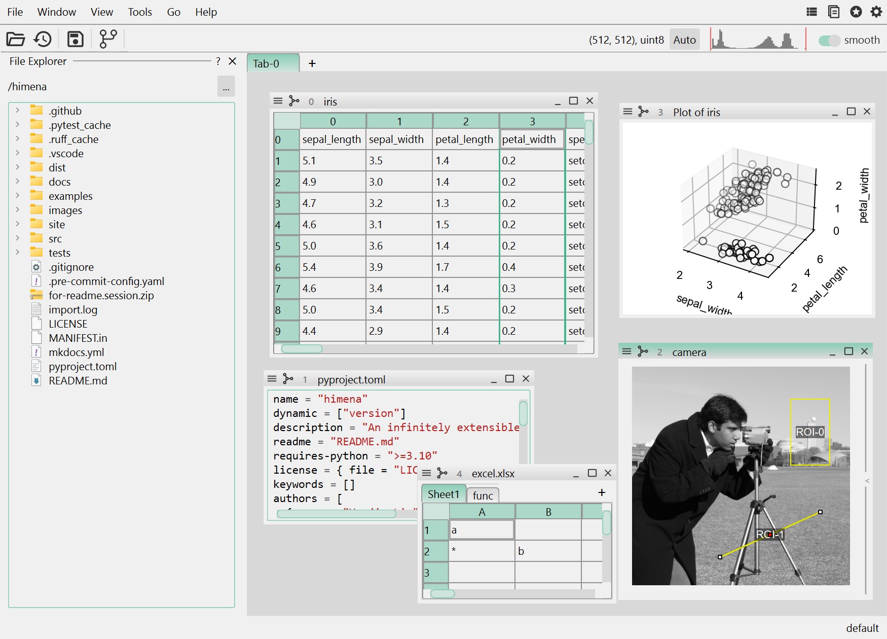

# Himena

[](https://pypi.org/project/himena)
[](https://pypi.org/project/himena)
[](https://codecov.io/gh/hanjinliu/himena)

-----



An infinitely extensible and reusable applications framework.

Python has a lot of third-party GUI libraries for different purposes. They ususally
implements their own reader/writer functions, widgets and plugins, which forces
programmers to repeat the same code over and over again for different projects.
`himena` abstracts the logic of the common workflow to allow different GUI ideas
to be implemented in a single framework.

## Installation

```shell
pip install himena -U
```

## Start application

```shell
himena
```
