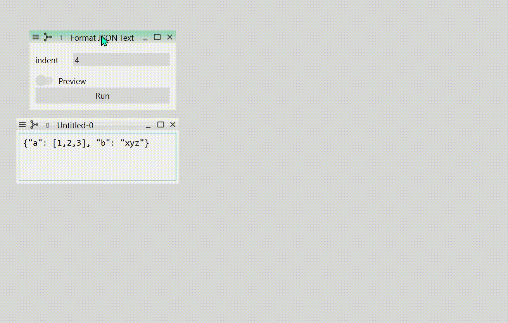

# Register Functions

To process and analyze data, you need functions that convert an object into another.
This section tells you how to register such functions so that you can run them on the
GUI.

## Function Definition

Basically, a function that processes data is a function that takes a `WidgetDataModel`
object and returns another `WidgetDataModel` object. For example, the following function
formats a non-indented json text data into an indented, pretty json text data.

``` python
from himena import WidgetDataModel

def format_json(model: WidgetDataModel) -> WidgetDataModel:
    value = json.dumps(json.loads(model.value), indent=4)
    return WidgetDataModel(value=value, type="text")
```

Because `himena` has its default widget for `"text"`-type model, this function can be
readly used in the GUI. You can register this function using `register_function()`
function.

``` python hl_lines="5"
from himena import WidgetDataModel
from himena.plugins import register_function
import json

@register_function(title="Format JSON Text")
def format_json(model: WidgetDataModel) -> WidgetDataModel:
    value = json.dumps(json.loads(model.value), indent=4)
    return WidgetDataModel(value=value, type="text")
```

The registered function will be shown in the menu bar (under the "Plugins" menu by
default) and the command palette. When this function is called from the GUI, currently
active window will be converted into a `WidgetDataModel` object and passed to the
function. The returned `WidgetDataModel` object will then be converted into another
window.

---

## Dependency Injection and Type Narrowing

`himena` uses [`in_n_out`](https://github.com/pyapp-kit/in-n-out) library to inject
the application context into functions. For example, in the previous example, the
`WidgetDataModel` of the current window is injected to the `model` argument of the
`format_json` function. If no window is activated, the "Format JSON Text" menu is grayed
out.

Here are the list of type hints that will be provided to the argument.

- [`WidgetDataModel`][himena.types.WidgetDataModel]: The current window's data.
- [`TabArea`][himena.widgets.TabArea]: The current tab area.
- [`SubWindow`][himena.widgets.SubWindow]: The current window.
- [`MainWindow`][himena.widgets.MainWindow]: The main window.
- [`ClipboardDataModel`][himena.types.ClipboardDataModel]: The clipboard data.

And here are the list of return types that will be processed.

- [`WidgetDataModel`][himena.types.WidgetDataModel]: The returned value will be added to the current tab.
- `list[WidgetDataModel]`: Each item will be added to the current tab.
- [`Parametric`][himena.types.Parametric]: The returned function will be converted into a GUI for user input of
  parameters (see [here](#parametric-functions)).
- [`ClipboardDataModel`][himena.types.ClipboardDataModel]: The returned data will overwrite the system clipboard.
- [`WidgetConstructor`][himena.types.WidgetConstructor]: The returned function will be executed to add a new sub-window with the constructed widget.
- [`concurrent.Future`](https://docs.python.org/3/library/concurrent.futures.html#concurrent.futures.Future): The returned job will be executed asynchronously.

A problem of the example above is that the `model` argument may contain any type of
data (not only `"text"`-type data). To narrow the type of data, you can use the `types`
argument of the `register_function()` decorator.

``` python hl_lines="5"
from himena.consts import StandardType

@register_function(
    title="Format JSON Text",
    types=[StandardType.TEXT],
)
def format_json(model: WidgetDataModel) -> WidgetDataModel:
    ...
```

With this, the "Format JSON Text" menu will be enabled only if the current window is a
widget for `"text"`-type data. Another benefit is that this command will be added to the
[model menu](../tutorial.md#model-menu-button) of the `"text"`-type widget.

---

## Place the Function in Any Places in Menu Bar

The place to put the function in the menu bar can be specified by the `menus` argument
of the `register_function()` decorator. Each menu is specified by a "/"-separated string
identifier. Following is an example that puts the function in the
"my-plugins > my-text-plugins" menu.

``` python hl_lines="7"
from himena import WidgetDataModel
from himena.plugins import register_function

@register_function(
    title="Format JSON Text",
    types=[StandardType.TEXT],
    menus=["my-plugins/my-text-plugins"],
)
def format_json(model: WidgetDataModel) -> WidgetDataModel:
    ...
```

To define how to display the menu title, you can use [`configure_submenu()`][himena.plugins.configure_submenu].

``` python hl_lines="1 9"
from himena.plugins import configure_submenu

configure_submenu("my-plugins", title="My Plugins")
configure_submenu("my-plugins/my-text-plugins", title="My Text Plugins")
```

---

## Parametric Functions

Many functions require parameter inputs. It is very easy to implement a parametric
function in Python: just add more arguments to the function. However, implementing
parametric functions in GUI is usually tedious, as you need to create a specific
widget for every function.

`himena` uses [`magicgui`](https://github.com/pyapp-kit/magicgui) package to convert a
function with parameters into a GUI widget based on the type hints of the function.
Therefore, **you can easily register a parametric function just by returning a function**
that takes parameters.

To tell `himena` that the returned value should be converted into a GUI for user input
of parameters, you need to **annotate the returned value with the `Parametric` type**.

``` python hl_lines="2 8"
from himena.plugins import register_function
from himena.types import Parametric

@register_function(
    title="Format JSON Text",
    types=[StandardType.TEXT],
)
def format_json(model: WidgetDataModel) -> Parametric:
    def run_format_json(indent: int = 4):
        value = json.dumps(json.loads(model.value), indent=indent)
        return WidgetDataModel(value=value, type="text")
    return run_format_json
```

The type-to-widget mapping is as follows:

- `int`, `float`, `str`, `list[int]`, `list[float]` &rarr; Line edit with the
  corresponding type.
- `bool` &rarr; Toggle switch.
- `enum.Enum`, `typing.Literal` &rarr; Combo box with the choices.
- `pathlib.Path` &rarr; Entry with a file dialog button.
- `tuple` &rarr; Group box with the corresponding types.
- `WidgetDataModel`, `list[WidgetDataModel]`, `SubWindow`, `list[SubWindow]`
  &rarr; Drop area that can drop other sub-windows to provide the corresponding data.

---

## Configure Parameter Input Window

The parameter input window is automatically generated by `magicgui`. You can further
customize its appearance by [`configure_gui()`][himena.plugins.configure_gui] decorator.

``` python hl_lines="1 9"
from himena.plugins import register_function, configure_gui
from himena.types import Parametric

@register_function(
    title="Format JSON Text",
    types=[StandardType.TEXT],
)
def format_json(model: WidgetDataModel) -> Parametric:
    @configure_gui(
        indent={"label": "Indent in Spaces", "min": 0, "max": 8},
    )
    def run_format_json(indent: int = 4):
        value = json.dumps(json.loads(model.value), indent=indent)
        return WidgetDataModel(value=value, type="text")
    return run_format_json
```

`configure_gui` takes keyword arguments that are passed to the function it decorates,
and use `dict` to configure the widget used for the parameter input.

Here's some of the options you can use.

- `label`: The label of the input field.
- `value`: The default value.
- `choices`: List of choices.
- `widget_type`: Widget class to use. This option must be a [`magicgui` ValueWidget](https://pyapp-kit.github.io/magicgui/widgets/).
- `min`: The minimum value (if applicable).
- `max`: The maximum value (if applicable).

!!! note

    To avoid argument name collision, you can pass the options as a dict to
    `gui_options`.

    ``` python
    @configure_gui(
        gui_options={"indent": {"label": "Indent in Spaces", "min": 0, "max": 8}},
    )
    def run_format_json(indent: int = 4):
        value = json.dumps(json.loads(model.value), indent=indent)
        return WidgetDataModel(value=value, type="text")
    ```

---

## Preview Function Outputs

In some cases, parameters should be tuned based on the output of the function. For
example in the case of the `format_json` function, the user may want to see the output
so that the json string looks good. To add a "preview" toggle button to the parameter
input window, just add the `preview` argument to the `configure_gui()` decorator.

``` python hl_lines="6"
@register_function(
    title="Format JSON Text",
    types=[StandardType.TEXT],
)
def format_json(model: WidgetDataModel) -> Parametric:
    @configure_gui(preview=True)
    def run_format_json(indent: int = 4):
        value = json.dumps(json.loads(model.value), indent=indent)
        return WidgetDataModel(value=value, type="text")
    return run_format_json
```

{ loading=lazy width=700px }

---

## Asynchronous Execution

It is also very easy to make your function asynchronous (make the application responsive
during the execution). Just add the `run_async=True` argument to the
`register_function()` decorator.

``` python hl_lines="4"
@register_function(
    title="Format JSON Text",
    types=[StandardType.TEXT],
    run_async=True,
)
def format_json(model: WidgetDataModel) -> Parametric:
    def run_format_json(indent: int = 4):
        value = json.dumps(json.loads(model.value), indent=indent)
        return WidgetDataModel(value=value, type="text")
    return run_format_json
```

!!! warning "Do not update the GUI from an asynchronous function"

    You should not update the GUI from an asynchronous function, because it can only be
    updated in the main thread.

    ``` python title="This function crashes the application"
    @register_function(
        title="Add widget",
        run_async=True,
    )
    def add_widget(ui: MainWindow):
        ui.add_widget(QtW.QLabel("Hello, world!"))
    ```
