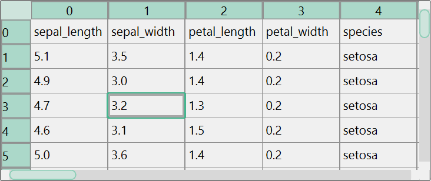
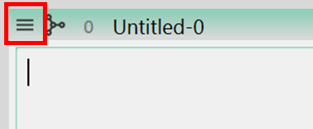
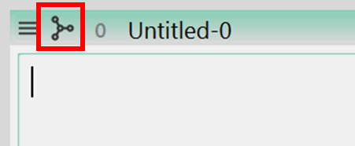
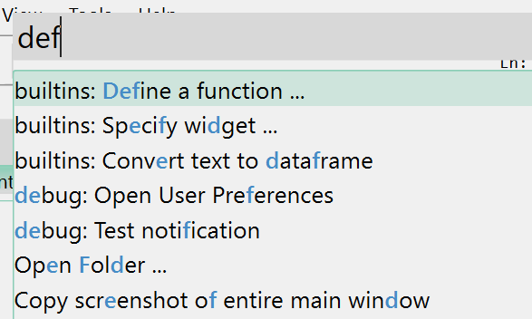
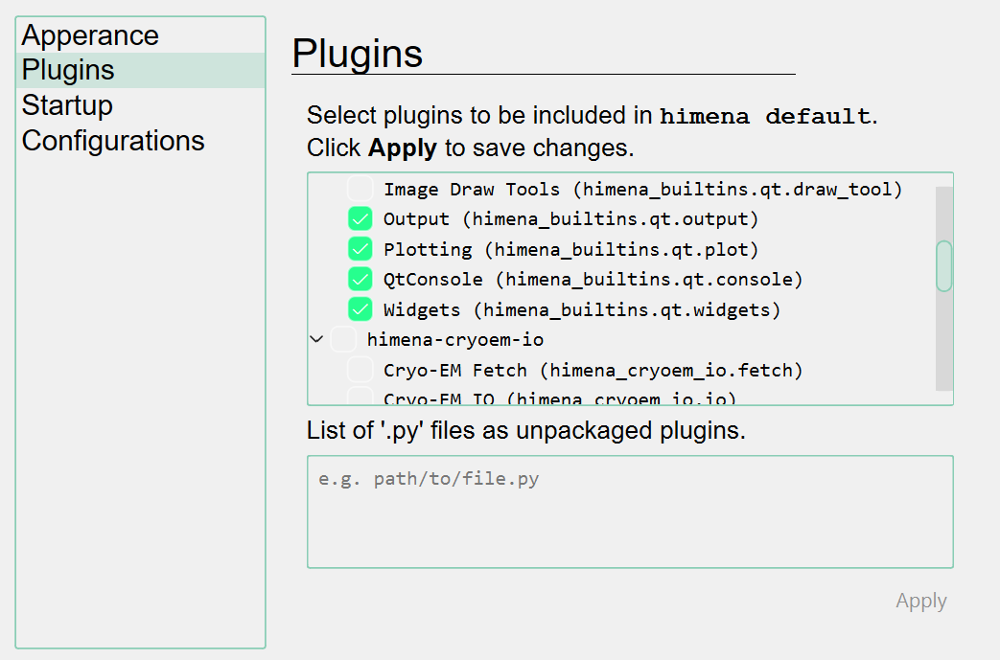

# Tutorial

## Installation

`himena` is available on PyPI. You can install it with the recommended dependencies:

``` shell
pip install himena[recommended]
```

or with the minimal dependencies:

``` shell
pip install himena
```

## Start Application

After installation, you can start the application by running the `himena` command:

``` shell
himena
```

`himena` can manage multiple profiles. A profile is a set of configurations, color theme
and plugins. You can create a new profile of name "test" with:

``` shell
himena --new test
```

and start the application with the profile:

``` shell
himena test
```

!!! note

    A profile can be used to separate the configurations for different users, or for
    different purposes. For example, you can have a profile "img" for image analysis,
    in which `himena img` is just like a sub-command of `himena`.

## Open a Data

Let's start with a simple example. From the menubar, select `File > New > Seaborn > iris`.
This command will fetch the iris dataset online and open it as a subwindow.

{ loading=lazy, width=400px }

In `himena`, a subwindow represents a single data model. For example, this iris dataset
is opened as a "table" data model. `himena` automatically picked the table viewer widget
to display the data.

Of course, you can open a local file from `File > Open File(s) ...` menu, ++ctrl+o++
shortcut, drag-and-drop or directly paste the data from the clipboard.

There are also several ways to create a new window. They are listed in `File > New`
menu, or you can use ++ctrl+n++ shortcut to look for the available options.

## Execute Commands

Many commands are registered on the startup of the application. There are several ways
to run a command.

### Window Menu Button

{ loading=lazy, width=300px }

The "window menu button" pops up a menu that contains the commands relevant to the
operation on the current window. These commands are always available regardless of the
data model the window represents. For example, "Duplicate window" and "Copy path to
cliboard" are in the window menu.

### Model Menu Button

{ loading=lazy, width=300px }

The "model menu button" pops up a menu that contains the commands relevant to the type
of the underlying data model. For example, the "Convert table to text" is available in
the window "iris" just opened above.

### Command Palette

{ loading=lazy, width=420px }

All the commands are accessible from the command palette. Press ++ctrl+shift+p++ to open
the command palette and you can search for any commands by the name.

## Manage Plugins

`himena` is designed to be highly extensible. You can install plugins to add new IO
supports, new widgets, and commands. For example, [`himena-stats`](https://github.com/hanjinliu/himena-stats),
a himena plugin for statistical analysis, can be installed with the following lines.

``` shell
pip install himena-stats -U  # install to the python virtual environment
himena --install himena-stats  # install the module to the default profile
himena your-profile-name --install himena-stats  # install to a specific profile
```

You can also select which plugins to be included in the `himena` profile from the
setting dialog. A setting dialog can be opened from `File > Settings ...` or shortcut
++ctrl+comma++

{ loading=lazy, width=500px }

## The Python Interpreter Console

A built-in Qt console dock widget plugin is registered by default. You can oepn it by
shortcut ++ctrl+shift+c++.

{ loading=lazy, width=720px }
