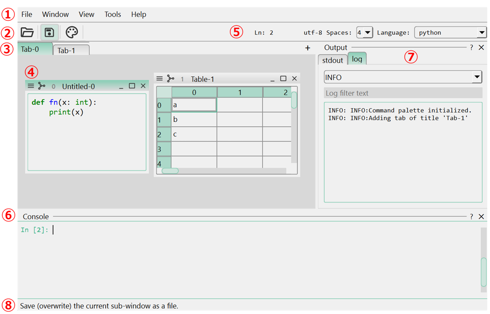
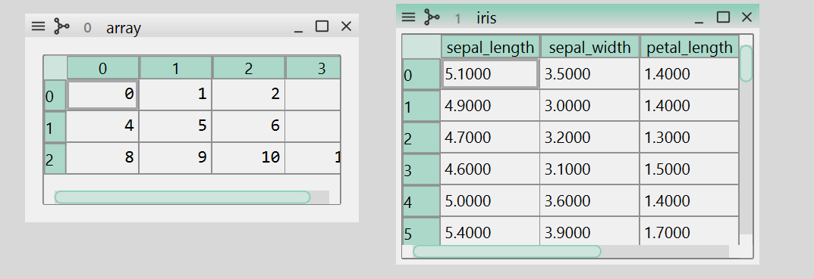
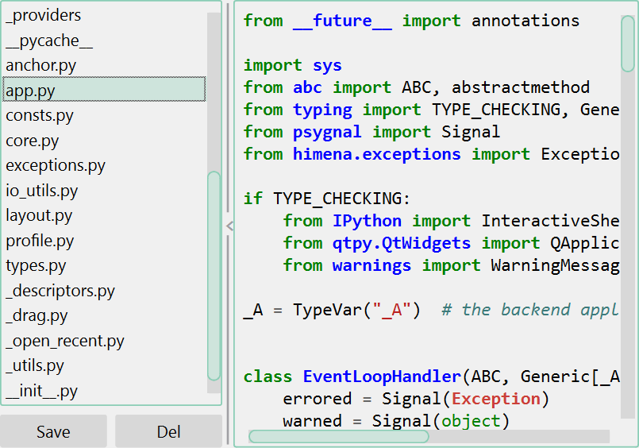
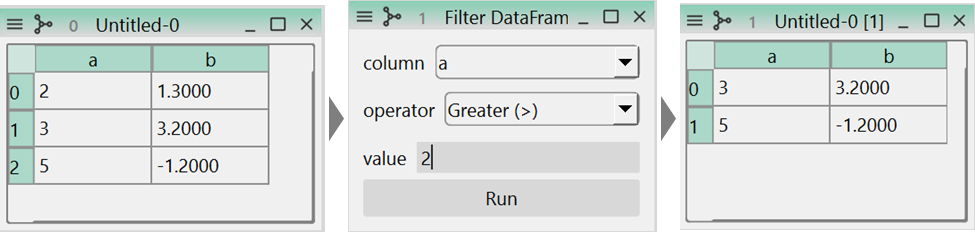
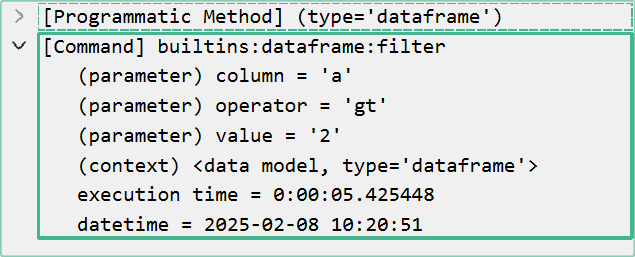

# Basics

## Application Design

### Appearance

`himena` GUI has components as shown below.

{ loading=lazy, width=660px }

1. **Menu bar**. It contains most of the registered commands in the application.
2. **Tool bar**. It contains frequently used commands.
3. **Tab bar**. Each tab contains a sub-window area where widgets are placed.
4. **Sub-window**. Each sub-window contains a widget as its content.
5. **Control widget**. Each widget has a control widget that provides functionalities
   specific to the widget.
6. **Python interpreter console**. A console widget that can execute Python codes.
7. **Dock widget**. Widgets docked to the main window. These widgets are usually added
   by plugins. The Python interpreter console is also a dock widget.
8. **Status bar**. It shows simple one-line messages.

### Sub-window

A sub-window usually represents a single data, such as a `ndarray` or `DataFrame`.
Therefore, data processing is usually done by taking sub-windows as input and output.

{ loading=lazy, width=600px }

Each data is wrapped by a [`WidgetDataModel`][himena.types.WidgetDataModel] object,
which is tagged with some GUI-related information, so that the application understands
how to display, save and track the data.

In the Python interpreter console (++ctrl+shift+c++), variable `ui` is available as the
handler of the main window.

``` python
from himena.types import WidgetDataModel
import numpy as np

data = WidgetDataModel(value=np.arange(10), type="array", title="my array")  # (1)!
win = ui.add_data_model(data)  # (2)!
```

1.  Create a WidgetDataModel object. To interpret the data as an array, set the `type`
    attribute to `"array"`.
2.  Add the data model to the application as a sub-window.

More simply, you can just call `ui.add_object` method to directly add an object to the
application.

``` python
win = ui.add_object(np.arange(10), type="array", title="my array")
```

Data can be retrieved from the sub-window by calling `to_model` method.

``` python
win.to_model()
```

``` title="Output"
WidgetDataModel(value=<ndarray>, source=None, type='array', title='my array')
```

``` python
win.to_model().value
```
``` title="Output"
array([0, 1, 2, 3, 4, 5, 6, 7, 8, 9])
```


## Opening and Saving Files

### New file

Press ++ctrl+n++ and you will see a command palette pops up. This palette contains many
commands that are related to adding new items to the application. This category includes

- Empty window, such as a text or table.
- Opening a sample data.

For example, the "New Text" command will add a new text editor sub-window to the current
tab.

### Open files from the local disk

`himena` supports several ways to open files from the local disk.

#### (1) Open a file as a sub-window

This is the most common way to open a file. You can open a file from "File" menu press
++ctrl+o++ or drag-and-drop the file to the application.

Whether the file can be opened, and the opened data can be displayed as a widget,
depends on the plugins installed in the application profile. For example, `himena`
built-in readers cannot open TIFF files, but a TIFF reader is available in the
[`himena-image`](https://github.com/hanjinliu/himena-image) plugin.

??? tip "Data analysis without widget plugin"

    If `himena` cannot find a widget to represent the data that has just been read, you
    will see a widget saying "No widget registered for ...". This does not mean `himena`
    cannot read the data. You just don't have a "nice" way to visualize the data. You
    can still use the internal data model in the application.

#### (2) Open a folder as a sub-window

A special built-in widget can display a list of `WidgetDataModel` as a nested widget.
Opening a folder will read the folder contents as a collection like below.
This command is available from the "File" menu, ++ctrl+k++ &rarr; ++ctrl+o++, or
drag-and-drop the folder to the application.

{ loading=lazy, width=500px }

#### (3) Open a group of files as a sub-window

Instead of opening a folder, you can open a group of files as a sub-window just like
(2).

### Saving files to the local disk

You can save the data in the sub-window to the local disk by selecting "File" &rarr;
"Save" or pressing ++ctrl+s++. Whether the data can be saved to the specified format
depends on the plugins installed in the application profile.

## Data Processing

Most of the functions for data processing are defined by functions that take a
`WidgetDataModel` as the input and another `WidgetDataModel` as the output.

For example, starting from the data below

``` python
df = {"a": [2, 3, 5], "b": [1.3, 3.2, -1.2]}
ui.add_object(df, type="dataframe")
```

you can find "Filter DataFrame ..." command in the [model menu](../tutorial.md#model-menu-button).
This command will open a window for the parameter input, filter the data frame and show
the result in a new sub-window.

{ loading=lazy, width=640px }

The history of the data processing is recorded to the `WidgetDataModel`. You can open it
from the "Show workflow graph" command in the [window menu](../tutorial.md#window-menu-button).

{ loading=lazy, width=450px }

!!! note
    The workflow is just a `WidgetDataModel` with type `"workflow"`. Therefore, this
    operation is just a data processing like any other operations.

## Adding Custom Widgets

Currently, `himena` supports `Qt` as its GUI backend. Any `Qt` widgets can be added to
the application using `add_widget()` method.

``` python hl_lines="4"
from qtpy.QtWidgets import QLabel

label = QLabel("Hello, world!")
ui.add_widget(label, title="My Label")
```

If you have a widget wrapper of a `Qt` widget, it can also be added by defining the
`native_widget()` interface method.

``` python hl_lines="5 6"
class MyLabel:
    def __init__(self, text):
        self._qt_label = QLabel(text)

    def native_widget(self):
        return self._qt_label

label = MyLabel("Hello, world!")
ui.add_widget(label, title="My Label Wrapper")
```

??? note "Using `magicgui`"

    Because `himena` depends on `magicgui` in many places, `magicgui` widgets can
    be directly used without the `native_widget()` method.

    ``` python
    from magicgui import magicgui

    @magicgui
    def my_func(x: int, y: str):
        print(x, y)

    ui.add_widget(my_func, title="My MagicGUI")
    ```

Alternatively, you can add the widget as a dock widget using `add_dock_widget()`.

``` python hl_lines="2"
label = MyLabel("Hello, world!")
ui.add_dock_widget(label, title="My Label Dock Widget")
```

These rules also apply to the widget plugin system. See [here](../dev/register_widgets.md#use-wrapper-class)
for more details.
