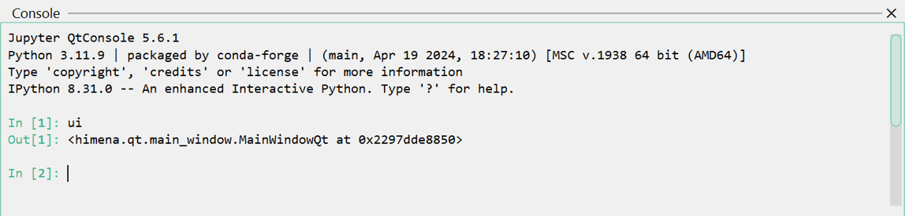
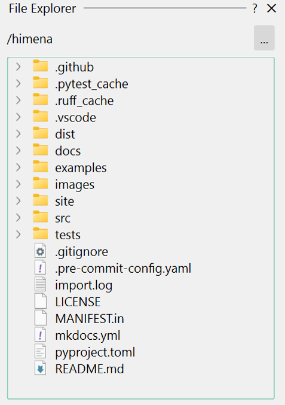
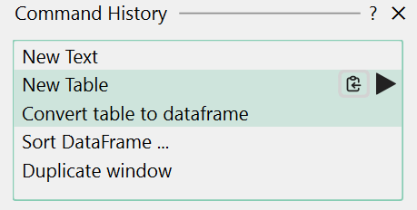
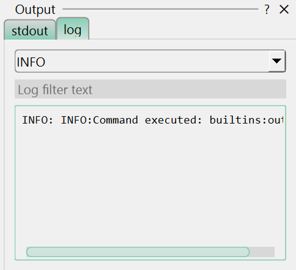

# Built-in Dock Widgets

The dock widget actions implemented in `himena_builtins` are listed under the "Tools >
Dock Widgets" menu.

## Python Interpreter Console

This widget is for running Python code interactively. The widget uses the
[Jupyter QtConsole widget](https://pypi.org/project/qtconsole/).

{ loading=lazy width=100% }

## File Explorer

This widget is for browsing files and directories. You can open files by double-clicking
the item, or drag-and-drop files to the main window area.

{ loading=lazy width=320px }

## Remote File Explorer (SSH)

This widget makes it easier to browse files on a remote server using `ssh`, and transfer
files between the local and remote machines using either `scp` or `rsync`.

{ loading=lazy width=320px }

!!! tip

    This remote file explorer is compatible with the local file explorer dock widget.
    You can directly drag-and-drop files between these file explorers to send files.

## Command History

This widget shows the history of commands that have been executed since the start of the
application. You can also re-run commands from this widget.

{ loading=lazy width=320px }

## Output Widget

This widget shows the standard output stream and the logging messages.

{ loading=lazy width=320px }
