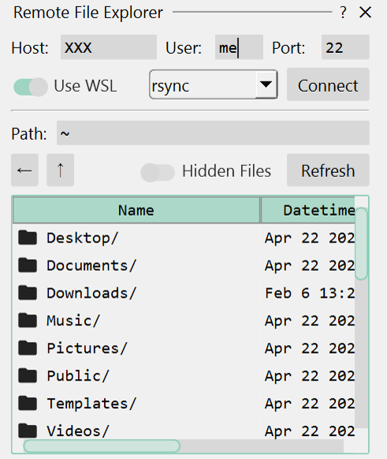

# Built-in Dock Widgets

The dock widget actions implemented in `himena_builtins` are listed under the "Tools >
Dock Widgets" menu.

## Python Interpreter Console

{ loading=lazy width=100% }

This widget is for running Python code interactively. The widget uses the
[Jupyter QtConsole widget](https://pypi.org/project/qtconsole/).

## File Explorer

{ loading=lazy width=320px }

This widget is for browsing files and directories.

## Remote File Explorer (SSH)

{ loading=lazy width=320px }

This widget makes it easier to browse files on a remote server using `ssh`, and transfer
files between the local and remote machines using `scp`.

## Command History

{ loading=lazy width=320px }

This widget shows the history of commands that have been executed since the start of the
application.

## Output Widget

{ loading=lazy width=320px }

This widget shows the standard output stream and the logging messages.
