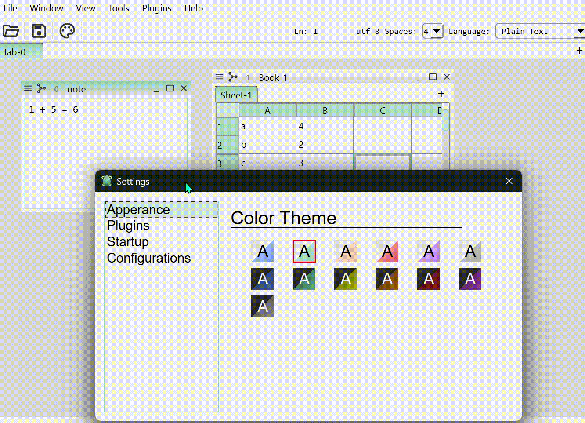
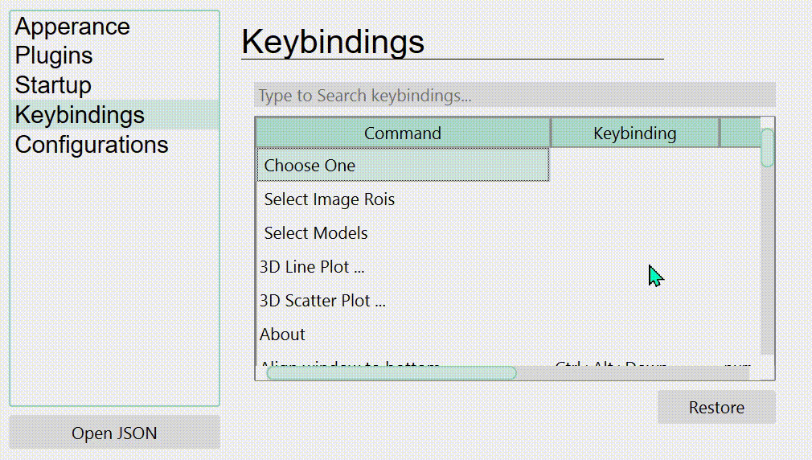
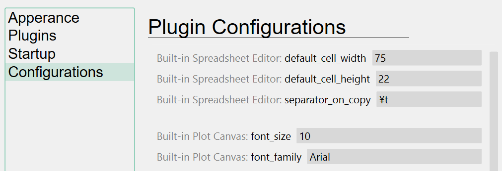

# Customization

You can customize your application profile from the setting dialog.

## Application Color Theme

There are several color themes available. You can select your favorite one from the
appearance tab in the setting dialog.

{ loading=lazy width=600px }

Alternatively, you can programmatically change it by setting the `theme` property.

``` python
ui.theme = "dark-green"
```

## Keyboard Shortcuts

You can customize keyboard shortcuts for various actions registered in the application.

{ loading=lazy width=600px }

## Plugin Settings

Many settings that are not directly relevant to the data itself (such as the table cell
size, default SSH host name, etc.) can be configured from the plugin settings tab.

{ loading=lazy width=600px }
