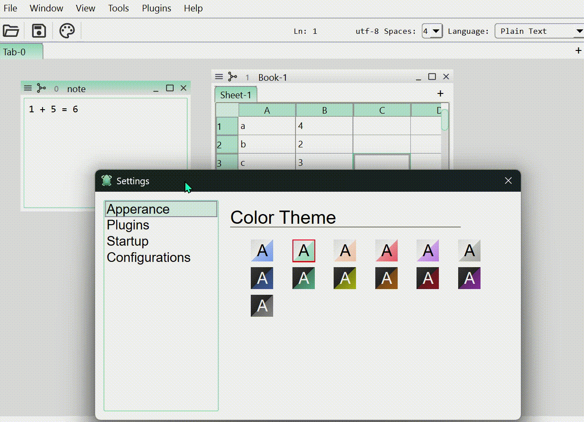
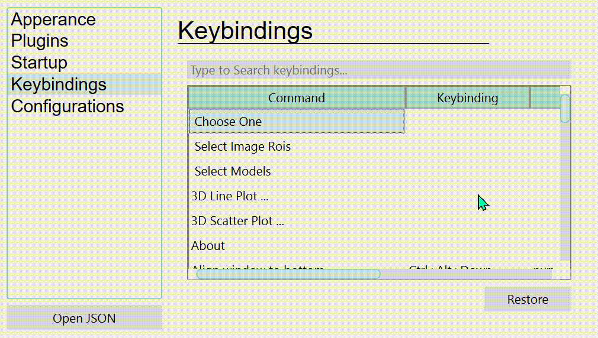
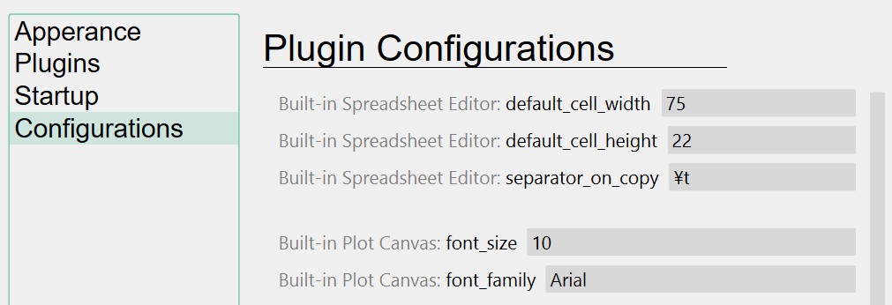

# Customization

You can customize your application profile from the setting dialog.

## Application Color Theme

There are several color themes available. You can select your favorite one from the
appearance tab in the setting dialog.

{ loading=lazy width=600px }

Alternatively, you can programmatically change it by setting the `theme` property.

``` python
ui.theme = "dark-green"
```

## Keyboard Shortcuts

You can customize keyboard shortcuts for various actions registered in the application.

{ loading=lazy width=600px }

## Warning Filters

Warnings raised during the application execution are shown as a notification popup.
Some of them are not informative at all &mdash; for example, a `DeprecationWarning`
that is raised deep inside a third-party module used by one of your plugins. In the
warnings tab of the setting dialog, you can define which warnings should be hidden in
the current profile.

Each filter has four fields.

- **Action** ... `ignore` to hide the matched warnings, `show` to keep showing them.
- **Category** ... name of the warning category, such as `DeprecationWarning`, or its
  fully qualified name, such as `numpy.exceptions.VisibleDeprecationWarning`.
  Subclasses of the category also match.
- **Message** ... regular expression searched in the warning message.
- **File path** ... regular expression searched in the path of the file that raised the
  warning, such as `skimage`.

Empty fields match anything. Filters are checked from the top and the first matched one
determines the result, so that a `show` filter placed above an `ignore` filter works as
an exception. Filtered warnings are not shown as a notification popup, but are still
sent to the standard error.

Because filters are stored in the profile, a profile in which a specific module is
installed can silence the warnings raised by that module only.

## Plugin Settings

Many settings that are not directly relevant to the data itself (such as the table cell
size, default SSH host name, etc.) can be configured from the plugin settings tab.

{ loading=lazy width=600px }
